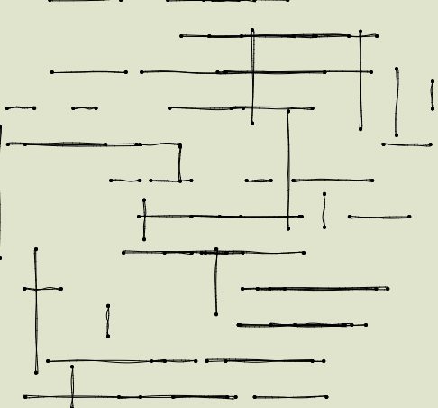
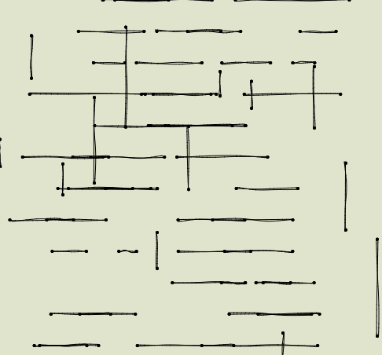

# p5js-hand-drawn-lines

An experiment with a hand-drawn line algorithm by Nikolaus Gradwohl

Draws something like a level from a platformer game (completely random, not necessarily playable).

## Screenshots

* 
* 
